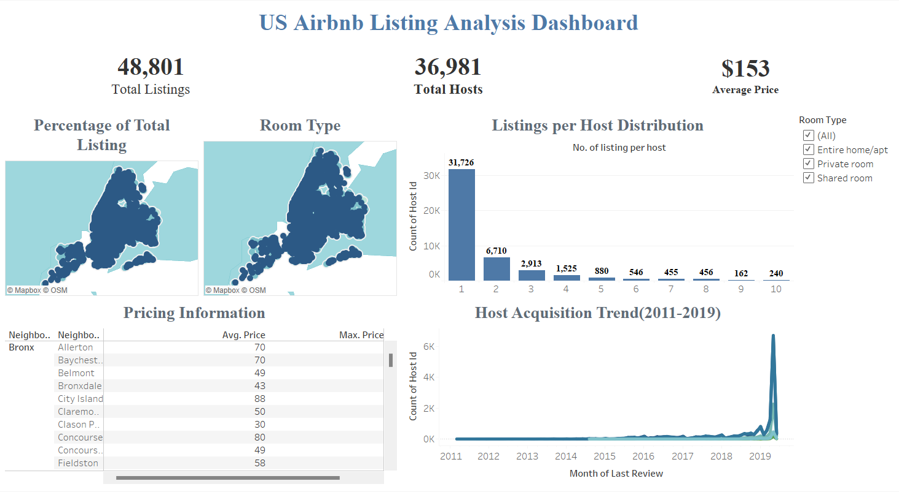

# US Airbnb Listing Analysis – Tableau Dashboard

## 📊 Project Overview
This project analyzes Airbnb listing data across the United States using Tableau.  
The dashboard provides an executive summary of key business metrics and interactive insights.

---

## 📌 Key KPIs
- **Total Listings:** 48,801  
- **Total Hosts:** 36,981  
- **Average Price:** $153  

---

## 📈 Dashboard Features
- Room Type Distribution  
- Hosting Frequency Analysis  
- Pricing Insights (Maximum & Average)  
- Host Acquisition Rate  
- Percentage Contribution of Listings  

---

## 🛠 Tools Used
- Tableau  
- Data Visualization Techniques  
- KPI Design  
- COUNTD Calculations  
- Dashboard Containers  

---

## 🎯 Business Insights
- Entire homes have higher average pricing compared to shared rooms.  
- A single host can manage multiple listings.  
- Pricing and listing distribution vary across room types.  

---

## 📷 Dashboard Preview

---

## 🚀 Author
Prerna Kale  
Aspiring Data Analyst
